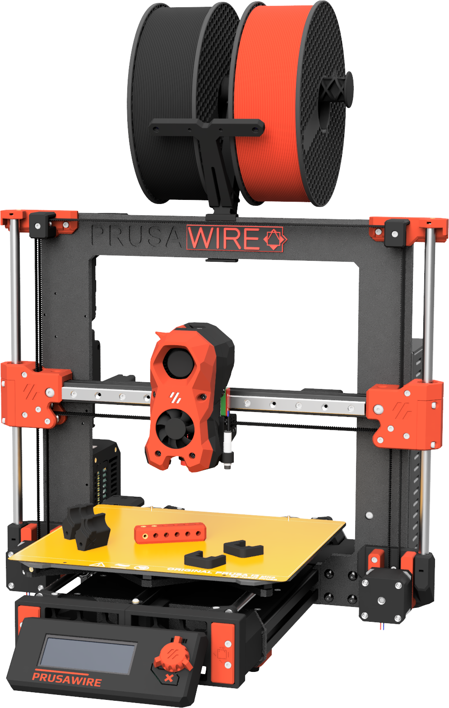

# Prusawire 2026.R1

A Prusa MK3/MK4 to Voron Switchwire Conversion. Originally from Positron 3D's 2025 April Fools, transformed into a mature and fun 3D printer!

Build Volume: 250mm (X) by 210mm (Y) by 185mm (Z).

## Current Release

2026.R1 was released on 2026-07-24.

View the [changelog](CHANGELOG.md) for a for detailed listing of project evolution.

Be sure to grab the latest STLs and documentation from the GitHub Repository.

Link to 2026.R1 CAD Viewer: [cad.positron3d.com](https://cad.positron3d.com)

## Manual & Documentation

[Assembly Manual](Manuals/Prusawire_2026.R1_Assembly_Manual.pdf).

[Prusawire Documentation and FAQ Site](https://prusawire.positron3d.com).

The [Official Positron3D CAD Viewer](https://cad.positron3d.com) can be very helpful in building Prusawire.

## Bill of Materials

[Prusawire 2026.R1 Bill of Materials](https://docs.google.com/spreadsheets/d/16whAEq4oKpdtc77cCxrXZkcxw_G3URlF5wZYUE42vhc/)

## Who This Printer is For

- You have an old MK3, MK3S, or MK3S+, and you want to teach an old dog new tricks and are on a budget
- You upgraded from MK4S to a Core ONE, and have a leftover frame. You are okay spending money on building a new printer with that hardware.
- You have a MK4 or MK4S that you want to Klipper-ize and experiment with!

Additionally, the following says this printer is for you: 

- You want to take your first steps into RepRap beyond Prusa, and Voron is an exciting route.
- You are comfortable working from a CAD file as your build guide
- You respect the Frankenstein-y nature of this April Fools joke printer

## Want to Support the Project?

First of all, thank you! Development costs have been mostly self-funded, with filament sponsored by Levendigs, and LDO Motors for providing the funds for the Prusa MK4 frame.

- Support Positron3D to fund future endeavors: 
   - [Donate to Positron3D](https://www.paypal.com/donate/?hosted_button_id=YGPRVTSHN4FQG)
   - [Positron3D Merch](https://nomadsgalaxy-shop.fourthwall.com/)

## Serial Numbers

We are accepting serial number requests on the [Positron 3D Discord](https://discord.gg/positron). Please submit your request to the #prusawire-serial-request channel over there. 

*Important Note:* Prusawire is _not_ a Voron Switchwire.  Please do not ask for help in the Voron Discord; instead utilize the #prusawire-discussions and #prusawire-questions channels on the Positron 3D Discord.

## Klipper Configuration Files

The most up–to–date Klipper configuration files for setting up or updating the Prusawire are in our [config repository](https://github.com/Positron3D/prusawire-klipper-config).

## Upgrading the Einsy Rambo to Klipper - Read this

Installing Klipper on the Einsy Rambo board is possible, with extra steps. Follow the guide [published by the awesome folks at MyRigs3D](https://myrigs3d.com/blogs/infos/revive-your-prusa-mk3s-with-klipper-1-5-flash-bootloader)! We recommend Method 2.

**Note:** Some users have reported problems using `avrdude` with the latest Raspberry Pi OS version (bookworm). If you experience error messages from avrdude complaining about gpio ports being busy, please try using the bullseye version of Raspberry Pi OS instead, available as "Raspberry Pi OS (Legacy)" in Raspberry Pi Imager.

## Credits 

Thank you to all the awesome people and companies that have made this possible.
- Positron 3D Team
- Nomads Galaxy, initial idea
- Ella Fox, the architect of Prusawire Beta 1
- Prusa Research - Prusa i3
- Voron Design - Switchwire
- Jason @ LDO Motors - Part sponsorship
- Levendigs & KB-3D - Part sponsorship
- Siraya Tech Filaments
- The many early access and beta testers

We hope you enjoy this build as much as we enjoyed making it.

The Prusawire Team:
@Safe // @erikbuild // @TheNexusAvenger

## Extra Credits for Existing Printed Parts

See the collection for the most up to date! To name them:

- Printable M3 T-Nuts for 3030 Extrusion, by Kapplion
- Stealthburner umbilical strain relief, by nagelwerkstatt

## Team

Prusawire is currently maintained by the Positron 3D Team.

- Design Lead: @Safe
- Documentation Lead: @erikbuild
- Software Lead: @TheNexusAvenger
