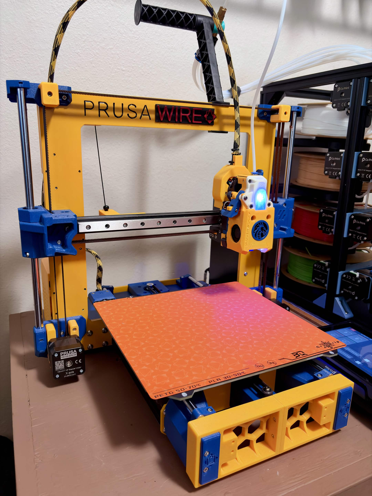
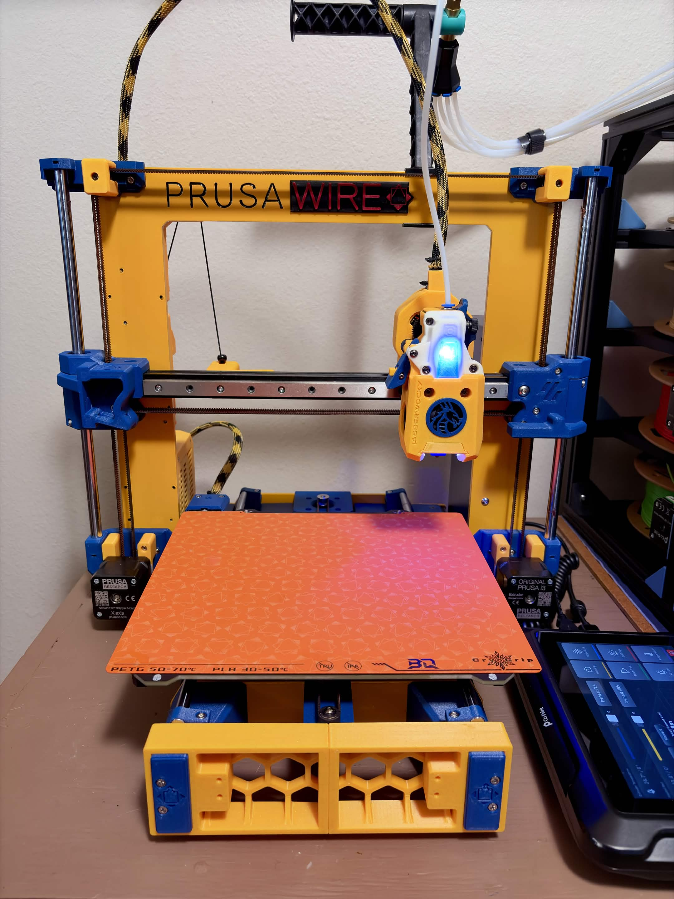

# Jabberwocky Mount

This is an experimental x-carriage/mount for Jabberwocky on the Prusawire 2026.R1.  

 

Use these files in lieu of the stock stealthburner mount files.  You may source the rest of Jabberwocky from the [Github](https://github.com/kinematicdigit/Jabberwocky).

If you use this, please give us feedback on either Discord or in GitHub issues! We are happy to help revise the mount as needed.
