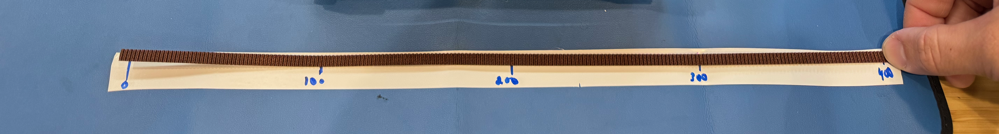
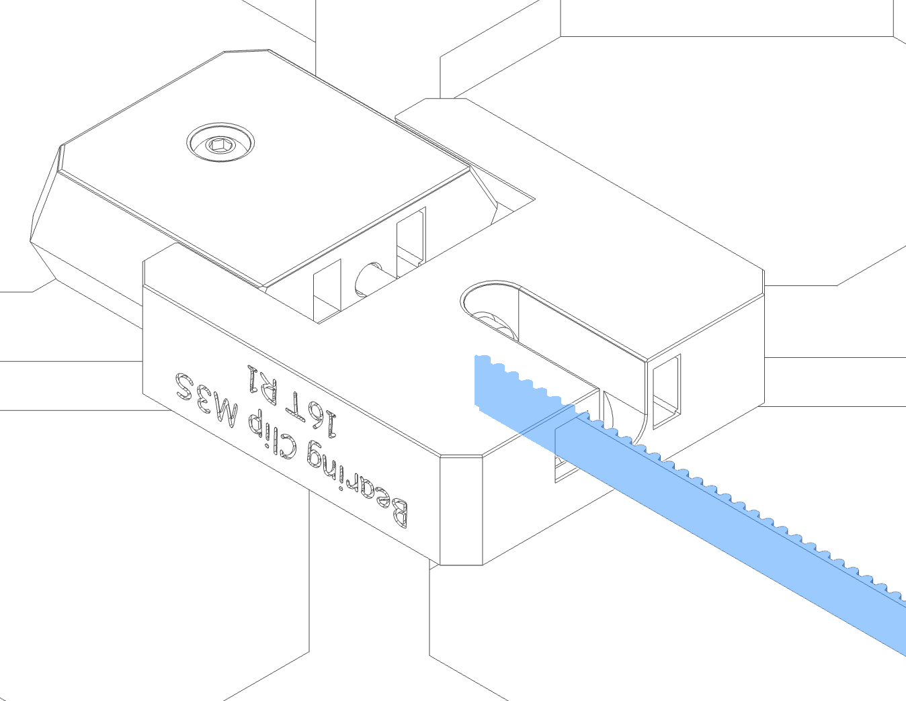
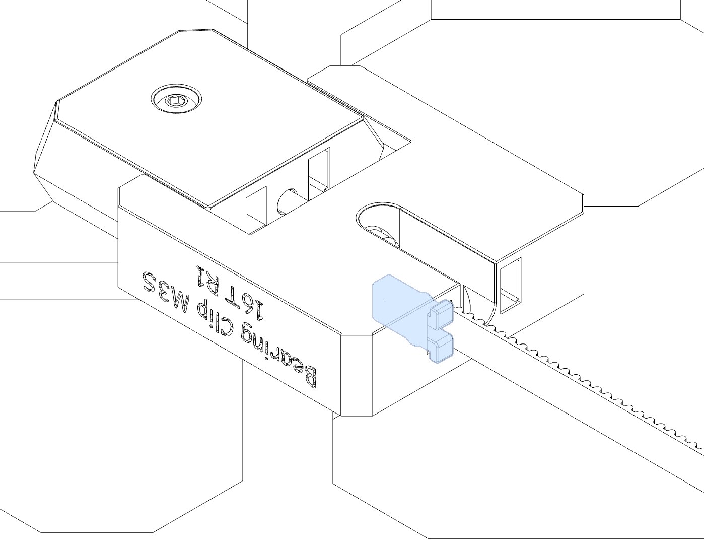
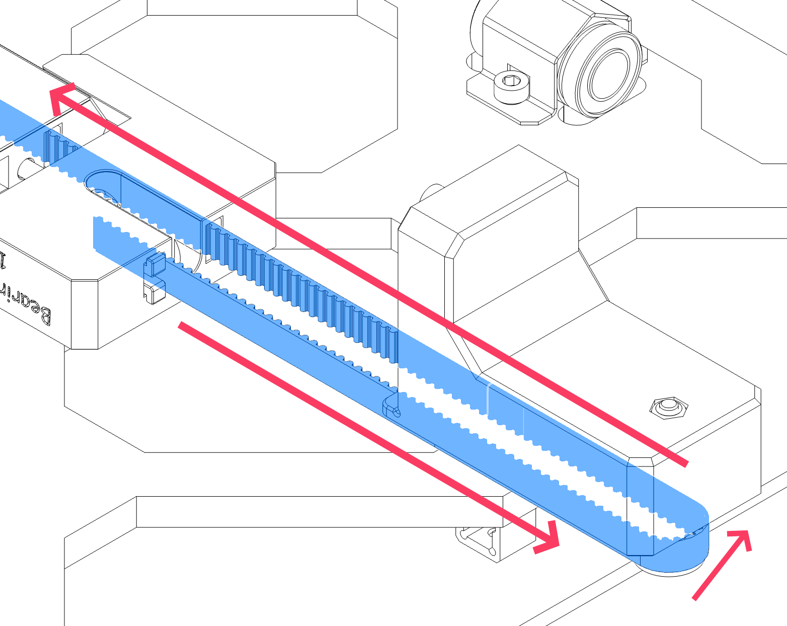
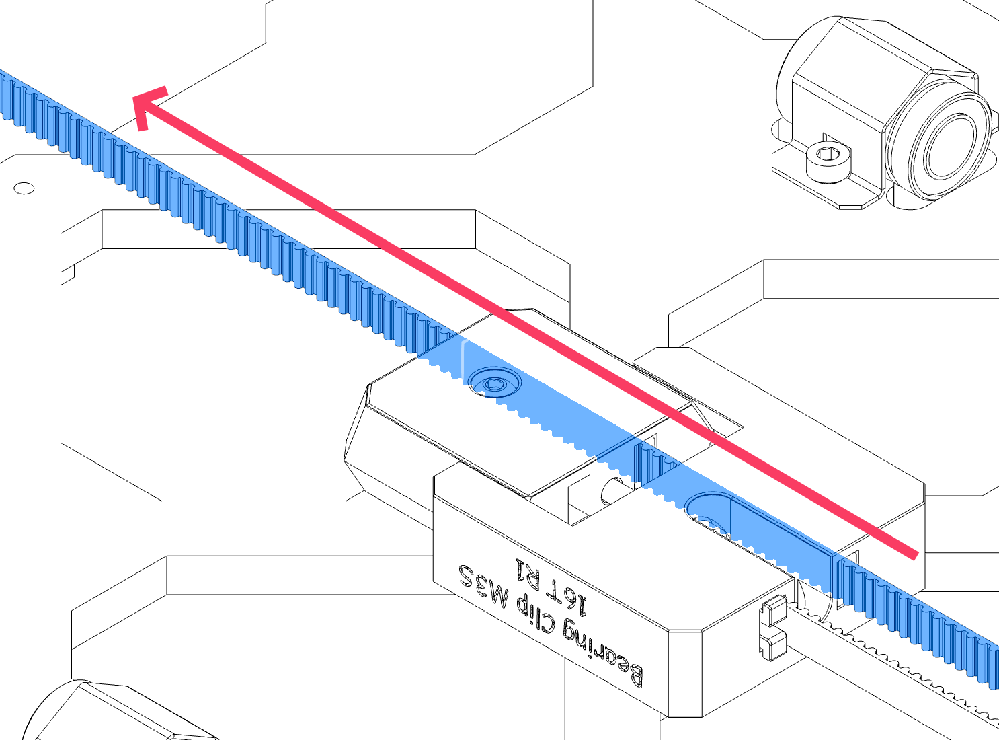
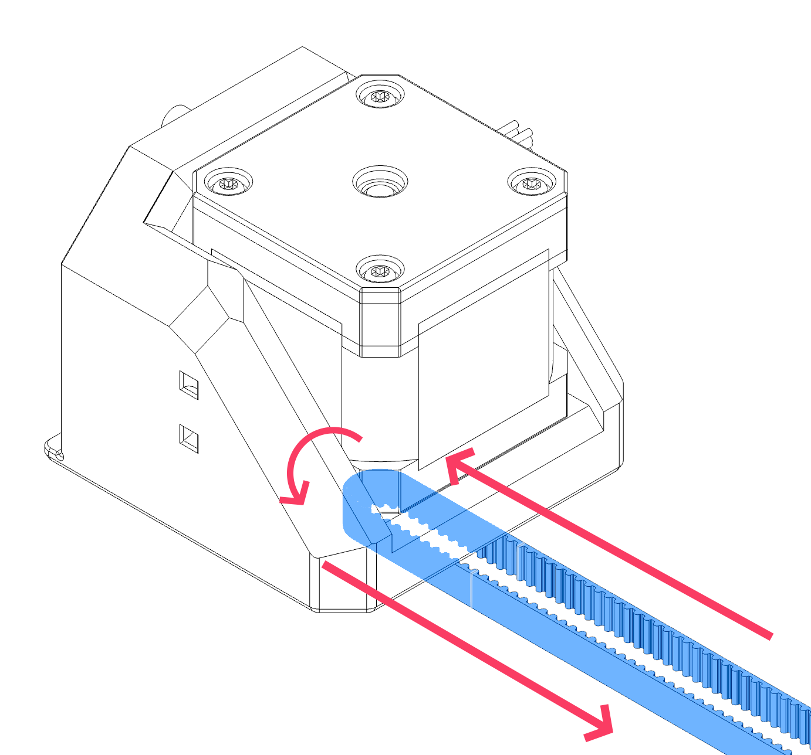
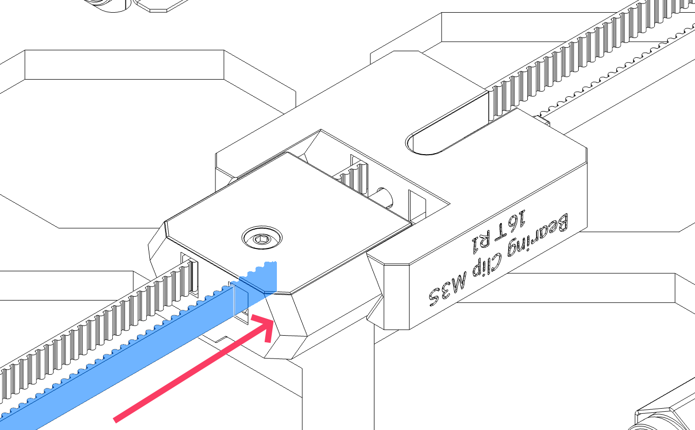
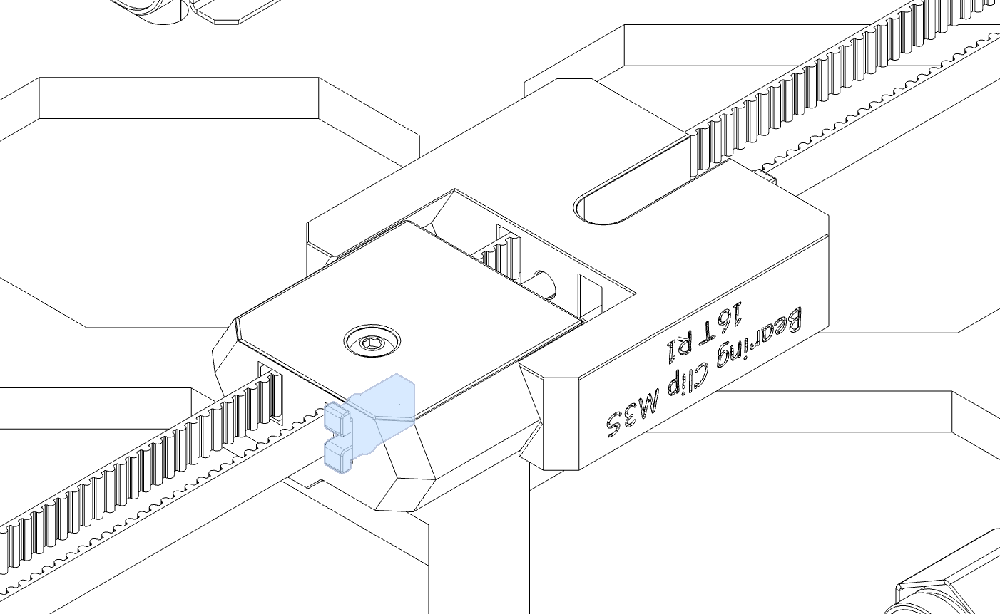
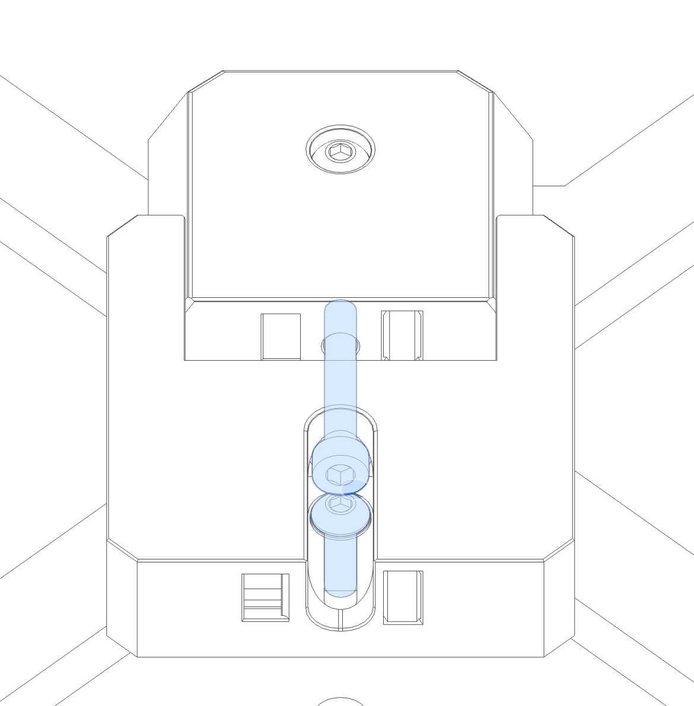
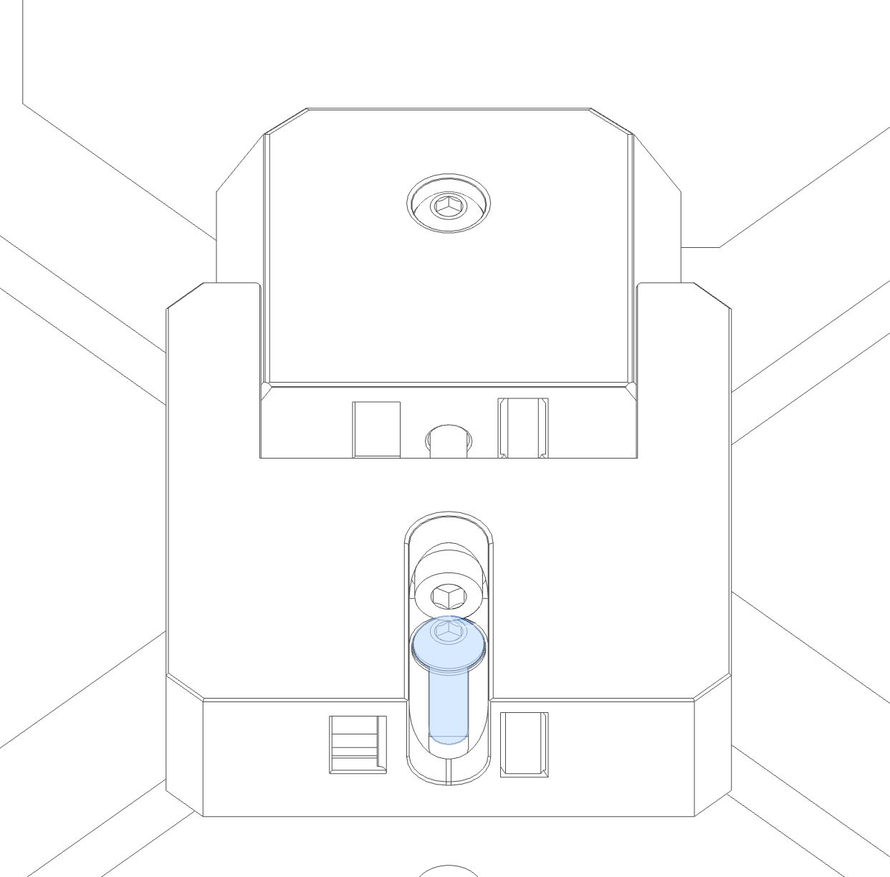

# Y Belt Installation and Tensioning
{: .no_toc}

  

    Table of contents
  

  {: .text-delta }
- TOC
{:toc}

**Compatibility:** *Prusawire 2026.R1*

## Overview
The Y belt must be installed and tensioned properly to ensure smooth and accurate bed motion.

**Important notes:**
- Extra belt length has been specified in the BOM; it is expected to have some leftover belt afterwards.
- Match your belt lengths before assembling the printer!
- When inserting the belt clips, there should be an equal number of teeth sticking out of the ends.
- **DO NOT cut your belts** until you are 1000% certain you have done it correctly.  It's okay to leave a little extra length hanging out the back of the toolhead carriage until final assembly and validation.

## Prerequisites
- You will likely find this easiest without the MK52 Heat Bed installed!

## Instructions 
### Belt Installation
1. Measure out 1000mm of GT2 belt for the Y axis.  Double-check your measurement, then cut this length.  Set aside for now.
	- *Tip: Mark some tape on your desk with 100mm increments using a tape measure or calipers.*

	

2. Gather all the needed parts:
	- 1x **1000mm Gates GT2 Belt**

3. Slightly loosen the M3x10 BHCS securing **y_belt_tensioner** to the Y Carriage.  Loosen the M3x20 SHCS tensioning screw almost all the way so the **y_belt_tensioner_front** can be pulled apart as much as possible (while the M3x20 is still engaged with the square nut).  This is the position of LEAST belt tension.

	
 
4. Insert one end of the belt into **y_belt_tensioner** as shown.  Ensure at least 6 teeth of the belt are in contact with the ridges on the tensioner.

	

5. Insert **[a]_belt_clip** to secure the belt.

	

6. Route the belt towards the front, around the front idler bearing stack, back into and through both halves of **y_belt_tensioner** towards the back of the printer.

	
	

7. Route the belt around the Y Motor Pulley and back around towards the front of the printer as shown.

	

8. Route the belt around the Y Motor Pulley and back around towards the front of the printer as shown.

	

9. Insert the other end of the belt into the belt slot on the back of the **y_belt_tensioner**.  You will need to trim the belt carefully at this point.  You want to have minimal to no slack in the belt and still have at least 5-6 teeth inside and engaged with the belt tensioner.  Secure with a belt clip.  *This may take a few tries to get perfect.  Err on the side of too long, you can always remove the belt clip and trim a little more off if you find it has too much slack!*.

	

### Belt Tensioning
To properly tension the Y belts:

1. Begin turning the **M3x20 SHCS tensioning screw** in the **y_belt_tensioner**.
	- Turn clockwise to increase tension.
	- Turn counterclockwise to decrease tension.

2. Once slack is removed, and prior to final tension:
	- **TRIPLE CHECK YOUR BELT to make sure it is riding correctly on the bearings and pulleys.  If it is not, loosen and correct.**

3. If the tensioning screw bottoms out (and you do not have adequate tension in the belts)
	- Loosen the tensioning bolt, try inserting one or both ends of the y belt a few more groove notches into the **y_belt_tensioner** and re-installing the belt clips to secure.  Tighten the tensioning screw again.

4. Follow up with tuning your belt tension with one of the final tensioning options below.  **Once you are satisfied, secure the assembly by tightening the M3x10 BHCS securing the tensioner to the Y Carriage!**

**Final Tensioning Options:**
- **PF Makes Belt Tensioning Meter:** [3D-Printer/GT2 Belt Tension Meter at main · Diyshift/3D-Printer · GitHub](https://github.com/Diyshift/3D-Printer/tree/main/GT2%20Belt%20Tension%20Meter)
	- Switchwire "Z" Spec - 1.8 to 2.2 (1.9 to 2.3 for EPDM high-temp belt)
- **Prusa Belt Tension Gauge:** [Tension Meter for the GT2 belts of i3 MK3S+ or Prusa MINI+ by Prusament \| Download free STL model \| Printables.com](https://www.printables.com/model/46639-tension-meter-for-the-gt2-belts-of-i3-mk3s-or-prus)
- **Biqu's Digital Belt Tension Tool:** [GitHub - bigtreetech/Belter-belt-tension-Tool: Belter belt tension Tool Info Page](https://github.com/bigtreetech/Belter-belt-tension-Tool)
- **Prusa Mobile App:** 
	- [Prusa on the Apple App Store](https://apps.apple.com/us/app/prusa/id6477531937)
	- [Prusa - Apps on Google Play](https://play.google.com/store/apps/details?id=com.prusa3d.connect&hl=en-US&pli=1)
	- Tuner Mode for *MK3S --> Y-Axis*
		- Carriage all the way to the right
- **Prusa Website Tuner:** [Prusa Belt tuner](https://belt.connect.prusa3d.com/)
	- *MK3S --> Y-Axis*
		- Carriage all the way to the right
- **Gates Carbon Drive Mobile App**
	- [Carbon Drive Belt Tension Tool on the Apple App Store](https://apps.apple.com/app/bicycle-belt-tension-meter/id438346486)
	- [Carbon Drive - Apps on Google Play](https://play.google.com/store/apps/details?id=com.gates.carbondrivecalculator&hl=en)
	- 85 Hz